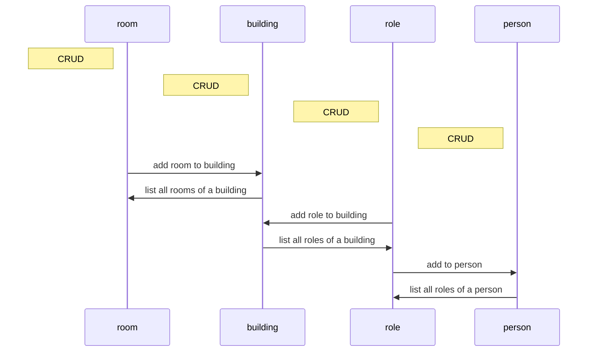

# About the project
My project is a real estate registry. 

The registry has 4 entities: 
- building,
- person, 
- room, 
- role,

And the required repository, service and controller layers of them.
All of them have the basic crud operations, plus more.


# Build with
- Java
- Java spring boot
- Rest api
- JPA
- SQL
- H2

## Clone the repo
  `git@github.com:blasesteban/real-estate-register-app.git`

## Initialize from docker
run the run.cmd file in the root.
```shell
./run.cmd
```
## Testing
I wrote unit and integration tests, and postman requests.
```shell
mvn test
```
the application must run for postman.
```shell
Set-ExecutionPolicy -ExecutionPolicy RemoteSigned -Scope CurrentUser
newman run realestateregister.postman_collection.json
```
## Endpoints:
- [building](http://localhost:8080/building)
- [person](http://localhost:8080/person)
- [role](http://localhost:8080/role)
- [room](http://localhost:8080/room)
