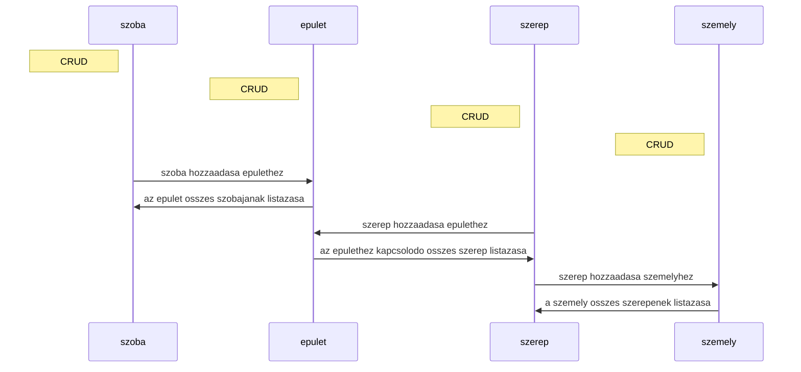

# A projektről
A projektem egy ingatlan nyilvántartás

A regiszter 4 entity osztállyal rendelkezik: 
- épület,
- személy, 
- szoba, 
- szerep,

És ezek mindegyikéhez tartozik egy repository, service és controller osztály.
Minden osztály rendelkezik az alap crud műveletekkel, vagy annál többel.


# Felhasznált technológiák
- Java
- Java spring boot
- Rest api
- JPA
- SQL
- H2

## Repo klónozás 
  `git@github.com:blasesteban/real-estate-register-app.git`

## Docker indítás
run the run.cmd file in the root.
```shell
./run.cmd
```
## Tesztelés
A teszteléshez unit és integrációs teszteket készítettem, továbbá postman lekéréseket adtam meg.
```shell
mvn test
```
A postman lekérésekhez az apinak futnia kell.
```shell
Set-ExecutionPolicy -ExecutionPolicy RemoteSigned -Scope CurrentUser
newman run realestateregister.postman_collection.json
```

## Végpontok:
- [épület](http://localhost:8080/building)
- [személy](http://localhost:8080/person)
- [szerep](http://localhost:8080/role)
- [room](http://localhost:8080/room)
